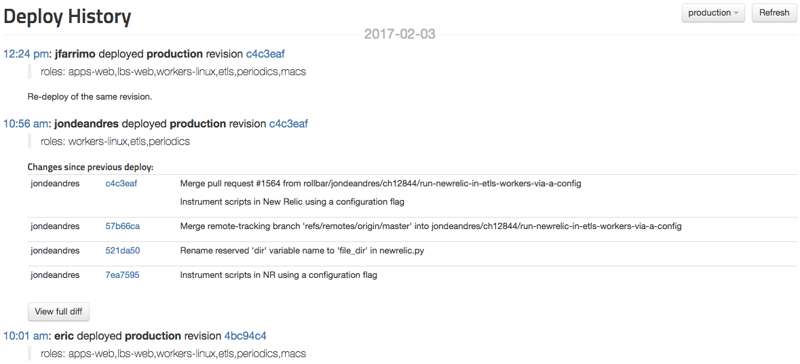
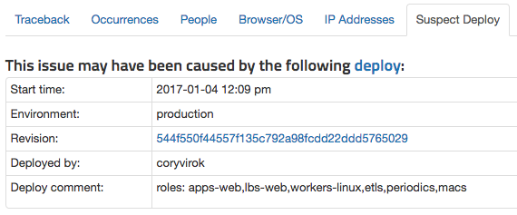
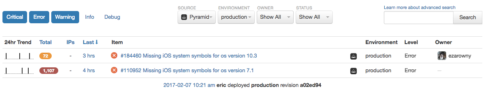

# Deploy Tracking

If you notify Rollbar every time you deploy or release your app, you'll unlock several features that will help your debugging process.

Instructions for reporting deploys are available for [Bash](/docs/deploys/bash/), [Bitbucket](/docs/bitbucket/#bitbucket-pipelines), [Capistrano](/docs/deploys/capistrano), [Engine Yard](/docs/deploys/engineyard/), [Fabric](/docs/deploys/fabric/), [Heroku](/docs/deploys/heroku), [MSBuild](/docs/deploys/msbuild), [Powershell](/docs/deploys/powershell), and [other tools and languages](/docs/api/deploys/#record-create-a-deploy).

## Deploys Screen

The deploy screen shows a detailed view of all deployments made to a particular environment.

The entry for each deploy includes:

* Timestamp
* Deploying user (if known)
* Target environment
* Code version (typically a Git SHA or a version number)
* Deploy comments
* List of commits included (if you've [connected Rollbar to a git repository](/docs/source-control/))

### Undeployed Changes

If you've [connected Rollbar to a git repository](/docs/source-control/), then your deploys page will show all commits that have not yet been deployed to production.

## Suspect Deploy

When deploys are reported to Rollbar, we'll attempt to identify a 'Suspect Deploy' for each error.

The suspect deploy is one of the following:

* The last deploy prior to the first occurrence of the error _(if the item has never been resolved)_.
* The last deploy prior to the reactivation of the error _(if the item was previously resolved)_.

We are planning to improve our suspect deploy algorithm in the future to improve its accuracy.

## Deploys in Item Feed

Deploys will appear in your live item feed so you can quickly see whether a recent deploy might be responsible for new errors.

## Auto-Resolve on Deploy

You may want to resolve all active items every time you deploy, so that only new occurrences of errors and messages will appear in your live feed.  This can be configured via **Project Settings --> Deploys**.

## Set Up

Deploy tracking in Rollbar can be set up in minutes:

* [Bash](/docs/deploys/bash/)
* [Bitbucket](/docs/bitbucket/#bitbucket-pipelines)
* [Capistrano](/docs/deploys/capistrano)
* [Engine Yard](/docs/deploys/engineyard/)
* [Fabric](/docs/deploys/fabric/)
* [Heroku](/docs/deploys/heroku)
* [MSBuild](/docs/deploys/msbuild)
* [Powershell](/docs/deploys/powershell)
* [Other tools and languages](/docs/api/deploys/#record-create-a-deploy)
