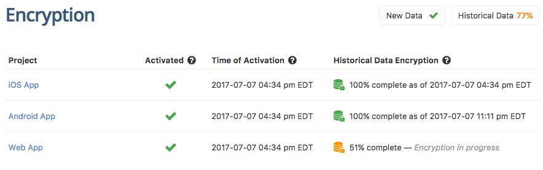

# Encryption at Rest

Encryption at rest ('encryption') is currently available to customers of our [compliance solutions](/compliance/).  For more information, [contact us](/compliance/#contact-us). 
{: .info}

When encryption is enabled, all existing data in all projects within your account will be encrypted and all new data will be encrypted as it is received.  

To view the status of the encryption process, go to **Account Settings --> Encryption**

The encryption status of each project in your account is displayed, as well as a summary of the overall progress towards encrypting all of the existing data within your account.

## Encryption Method

Rollbar uses an <a href="https://en.wikipedia.org/wiki/Galois/Counter_Mode" target="wikipedia">AES-256 GCM</a> algorithm to encrypt data at rest.  A unique encryption key is used for each Rollbar project.

If you have further questions about encryption at rest in Rollbar, please email [security@rollbar.com](mailto:security@rollbar.com)
{: .info}
