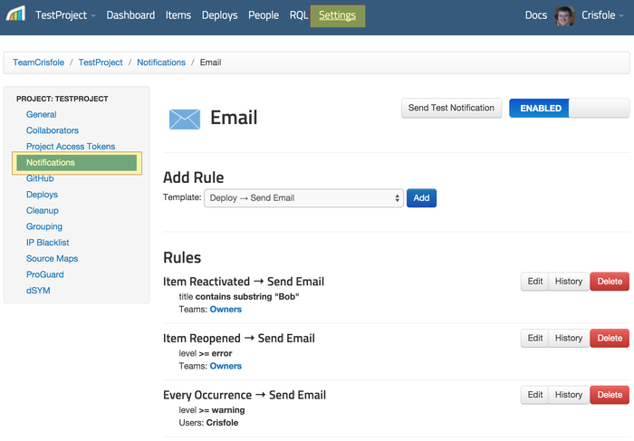
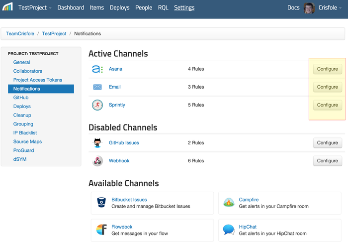
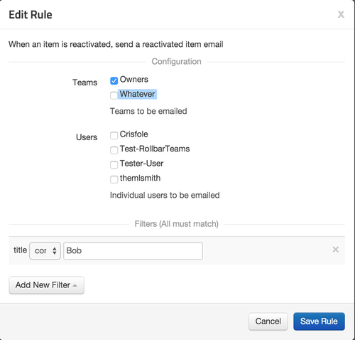

# Filtering Notifications

Having access to an error's full history is great, but you may not want to be notified every time a
customer hits an error you know about. To adjust the circumstances in which you receive
notifications you can use notification filters.

### Finding the settings

To find your notification settings navigate to the project you want to adjust,
click 'Settings' in the top menu, then click 'Notifications' in the left menu.

Select the notification type you wish to adjust (for instance: Email, GitHub Issues, Slack). Now
decide which rule you want to adjust and click Configure.

The edit rule dialog will appear:

The upper portion of the edit dialog is specific to each notification type (Slack has message
formats, Jira has custom API fields, Email has recipients by team and user, etc). The lower portion,
however, is fairly global varying only if a particular notification type can't be filtered in a
specific way (Deploys can't filter on 'level' for instance).

### Changing the Filter

Everything you need to adjust your filters can be found in the edit rule dialog.
If an item comes in that meets all the filters' requirements it's sent as a notification. Otherwise
it's ignored. To make the changes permanent be sure to press the Save button.

#### Adding a Filter

To add a filter you can click the 'Add New Filter' dropdown and select the field you wish to filter
on. The following fields are available:

| Name | Description
|-|-
| Comment | Compares the comment sent with a deploy
| Environment | Compares the environment a deploy was made to or to which an item was sent
| Filename | Compares all of the filenames to see if any match
| Method | Compares all of the method names to see if any match
| Level | Compares the item level
| Context | Compares the Context
| Source | Compares the source (BrowserJS, PHP, Rails, Python)
| Title | Compares the item title
| Path | Compares arbitarary item or occurrence fields. See "Editing a Filter" for fuller explanation.
| Unique IPs Affected | Compares the number of unique ips affected
| Threshold | Sets the High Occurrence Rate threshold
| Window | Sets the High Occurrence Rate window

You can use a regular expression in your notification filter if you wish. Rollbar uses [Python's regex engine](https://docs.python.org/2/library/re.html).

#### Editing a Filter

After adding a filter you can edit the filter by changing the form fields. Most of the filter fields
are self explanatory, but one, "path," requires additional explanation. For notifications on error
data (rather than Deploy data) you can select a "path" filter. This allows you to inspect the
occurrence that would have triggered this notification. You can send custom data and filter on that,
or use the existing data like url, user id, etc.

The top level level of `path` refers to the item. Things like `title`, `level`, `status` will work
here. In order to access occurrence-specific data you'll need to access the top level `body` field.
For example, to access the exception message you can use: `body.body.trace.exception.message` or
`body.body.trace_chain.*.exception.message`. If you can't figure out why this isn't working check
for the `body` prefix (duplicate if accessing error data within the `body` section), and then make
sure your item isn't a trace chain (found most often in Ruby, Java, and Node).

If you're not sure what path to use for a given notification filter you can always look at the raw
data representing a given occurrence. Use the "Show JSON" button at the bottom of the occurrence
page to view the object you'd ultimately be writing a path for.

#### Deleting a Filter

To delete a filter click the 'x' on the far right of the filter description.
