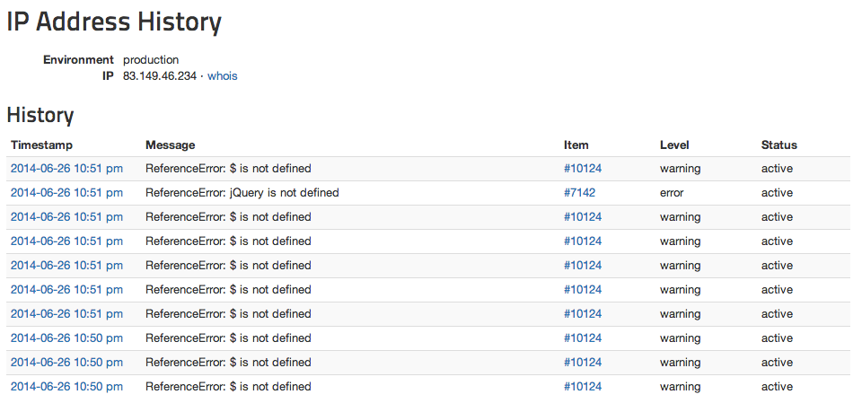

Similar to how you can see the history by Person, you can also see the history by IP address. If you're tracking down an issue affecting logged-out users, this can be really helpful.

To get there, click on an IP address anywhere in the Rollbar interface:

You'll be able to see all events affecting that IP:

There's also geolocation information (when available) and a handy link to the WHOIS record for the IP.
