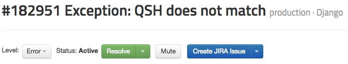
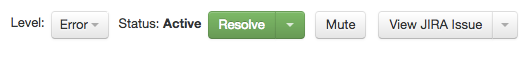
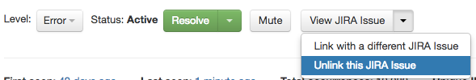

# Connect Rollbar to your Issue Tracker

Rollbar can integrate with [many popular issue trackers](/docs/tools/#issue-tracking) so you can manage Rollbar-detected errors in your existing workflow.

## Issue Tracking Options

When Rollbar is connected to your issue tracker you can _manually_:

* **Create** an issue to track a Rollbar error.
* **Link** a Rollbar error to an existing issue.

Additionally, Rollbar can be configured to _automatically_:

* **Create** an issue for new or frequently-occurring errors.
* **Reopen** a linked issue when a Rollbar error is reactivated or reopened by a user.
* **Resolve** a linked issue when a Rollbar error is resolved.

## Automatic Issue Tracking

## Manual Issue Tracking

Screenshots below are for JIRA , but the same features/concepts apply to all issue tracker integrations.{: .info}

When issue tracking is enabled for a project, users can manually create an issue for a Rollbar error by clicking the `Create` button at the top of the screen.

It's also possible to link a Rollbar error to an existing issue.

When a Rollbar error is linked to an issue, the `Create` button is replaced with a `View` button that will take you directly to the issue in your tracker.

You can change or remove the link via the dropdown menu on the `View` button.

## Setup Instructions
* [JIRA](/docs/jira/)
* [Trello](/docs/trello/)
* [Github](/docs/github/#github-issues)
* [Bitbucket](/docs/bitbucket/#creating-bitbucket-issues-from-a-rollbar-project)
* [Gitlab](/docs/gitlab/#creating-gitlab-issues-from-a-rollbar-project)
* [Asana](/docs/asana)
* [Pivotal](/docs/pivotal)
* [Sprintly](/docs/sprintly)
