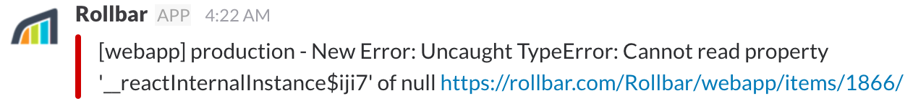
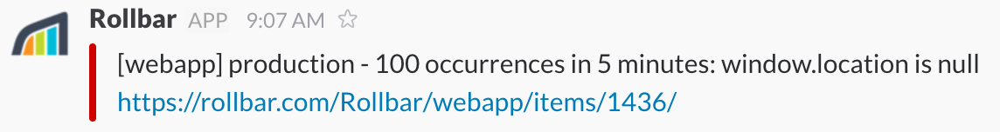
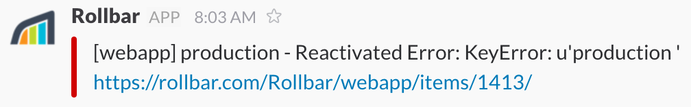
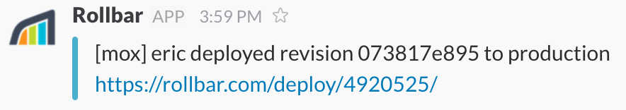

# Notification Types

Rollbar supports [many different messaging tools](/integrations/) where your team can get notified about errors and important events.

These notifications can be customized using [variables]() and triggered only in very specific conditions using [filters]().

This page describes the types of notifications you can configure across all available channels.

| Notification Type | Triggered when... | Example |
|-------------------|-------------|---------|
| _New Item_ | An error/ message is seen for the first time. |  |
| _Every Occurrence_ | Every time an error/ message occurs (_use wisely!_). | |
| _10^th Occurrence_ | 10th, 100th, 1,000th, 10,000th, ... occurrence | |
| _High Occurrence Rate_ | `{x}` occurrences seen in `{y}` minutes (_configurable_). | |
| _Item Resolved_ | An error/message is marked `Resolved`. | |
| _Item Reopened_ | An error/message is marked `Active` by a user. | |
| _Item Reactivated_ | An error/message occurs again after being marked `Resolved`. | |
| _Deploy_ | A new [deploy] is reported. | |
| _Daily Summary_ | _(Available in email only)_ Summary of daily error/message activity in a project | |

## Customizing Notifications

Rollbar gives you a great deal of control over when notifications are triggered and how they appear.
* [Notification Filters]()
* [Notification Variables]()

## Notification Setup
Setup procedures vary depending on which tools you are using.

### Messaging Apps
* [Slack]()
* [Hipchat]()
* [Flowdock]()
* [Campfire]()

### IT Alerting & Incident Management
* [PagerDuty]()
* [VictorOps]()
* [OpsGenie]()
* [Datadog]()

### Build Your Own
* [Webhooks]()

