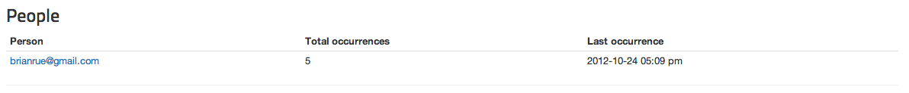
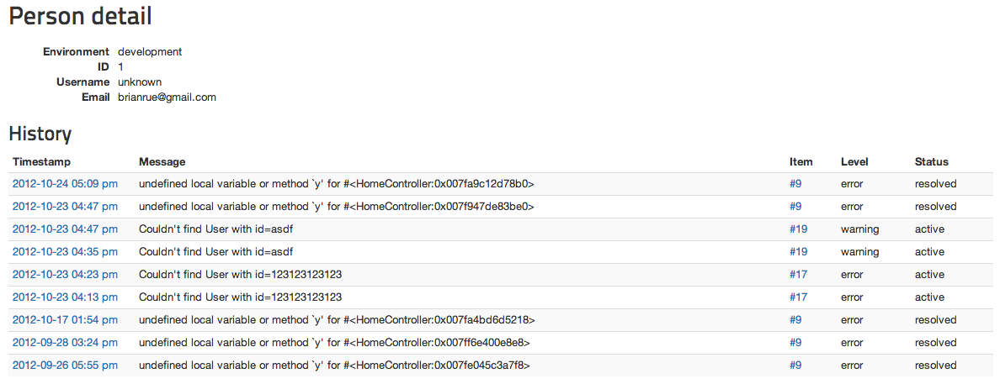
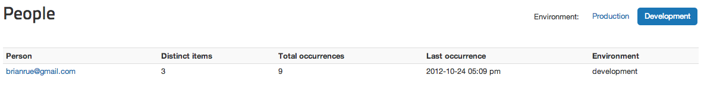

# People Tracking

Rollbar can track which of your People (users) are affected by each error. This works automatically
in our Rails and Django libraries, and is easy to set up for the rest.

You can see which people were affected by any one error:



Or the history of errors experienced by a particular person:



As well as the list of all people who have ever experienced an error, sorted by most recent error:



* {: .active} [Python](#python)
* [Ruby](#ruby)
* [PHP](#php)
* [Node](#node)
* [.NET](#net)
* [Java](#java)
* [Browser JS](#javascript)
* [iOS](#ios)
* [Android](#android)
* [Flash](#flash) 
{: .nav .nav-tabs}

<div class="tab-content">

```python
# Pyrollbar works by inspecting the `request` for a `rollbar_person`,
# `user` or `user_id` field (in that order). The first one it finds
# it uses as the person data assuming the object contains at least
# the `id` field.

# For a request with only a `user_id` field, the person is sent as
# follows: `{ id: request.user_id }`.

# Many/Most frameworks handle this all automatically.
```
{: .tab-pane .active #python}

```ruby
# For more documentation see:
# https://rollbar.com/docs/notifier/rollbar-gem/#person-tracking

# In Rails, Rollbar will automatically call the `current_user` method
# on the controller. The method name can be overridden in the Rollbar
# configuration:

Rollbar.configure do |config|
 config.person_method = 'current_user_override'
end

# The returned object should have `id`, `email`, and `username`
# methods. These method names can be overridden in the Rollbar
# configuration:

Rollbar.configure do |config|
  config.person_id_method = 'get_id'
  config.person_username_method = 'get_username'
  config.person_email_metohd = 'primary_email'
end

# If you are *not* using Rails, Rollbar will automatically pick up
# the `rollbar.person_data` key in the Rack environment and pass it
# on to the Rollbar website. It *must* have at least an `id` field.d
# `username` and `email` will also be treated specially.
```
{: .tab-pane #ruby}

```php
<?php
function get_current_user() {
    if ($_SESSION['user_id']) {
        return array(
            'id' => $_SESSION['user_id'], // required - value is a string
            'username' => $_SESSION['username'], // optional - value is a string
            'email' => $_SESSION['user_email'] // optional - value is a string
        );
    }
    return null;
}
$config['person_fn'] = 'get_current_user';
?>
```
{: .tab-pane #php}

```js
// node_rollbar works by inspecting the `request` for a `rollbar_person`,
// `user` or `user_id` field (in that order). The first one it finds
// it uses as the person data assuming the object contains at least
// the `id` field. Both `email` and `username` are also specially treated.

/**
* This is a pretend function that gets called before the handler for the
* request itself. It adds the appropriate object to the request so Rollbar
* can send the person data
*/
function beforeRequestHandler(request) {
  request.rollbar_person = {
    id: 42,
    email: 'dadams@example.com',
    username: 'dadams'
  }
}

// For a request with only a `user_id` field, the person is sent as
// follows: `{ id: request.user_id }`. If `user_id` is a function it will
// be evaluated before sending.

// If you are using the Passport authentication library no additional
// configuration is needed to make this work as expected.
```
{: .tab-pane #node}

```
Rollbar.PersonData(() => new Person
{
    Id = 123,
    Username = "rollbar",
    Email = "user@rollbar.com"
});
```
{: .tab-pane #net}


```java
import com.rollbar.Rollbar;
import com.rollbar.payload.data.Person;

public class HelloWorld {
    public static final Rollbar rollbar = new Rollbar(<token>, <env>);
    public static void main(String[] args) {
        Person person = new Person();
        Rollbar personRollbar = rollbar.person(person);
    }
}
```
{: .tab-pane #java}

```js
// To track the current user in Javascript you can alter your `_rollbarConfig`
// like so:

var _rollbarConfig = {
  // The usual
  payload: {
    // The usual
    person: {
      id: 42,
      username: 'dadams',
      email: 'dadams@example.com'
  }
}

// If you've already initialized Rollbar and need to set the user *after*
// initialization has already occurred you can use the `configure` method:

Rollbar.configure({
  payload: {
    person: {
      id: 456,
      username: "foo",
      email: "foo@example.com"
    }
  }
});
```
{: .tab-pane #javascript}

```objective_c
// In order to record the current user in an iOS application you must call
// `initWithAccessToken` with the optional `RollbarConfiguration` object.

// Something like this will work:

RollbarConfiguration *config = [RollbarConfiguration configuration];
[config setPersonId:@"42", username:"dadams", email:"dadams@example.com"];

[Rollbar initWithAccessToken:@"POST_CLIENT_ITEM_ACCESS_TOKEN" configuration:config];

// If you've already initialized the notifier, you can update the person later by
// getting the `config` object and calling `setPersonId` on it:

[config setPersonId:@"42", username:"dadams", email:"dadams@example.com"];
```
{: .tab-pane #ios}

```java
// After initializing Rollbar you can configure the person with the `setPersonData` method:

@Override
public void onCreate(Bundle savedInstanceState) {
    /** The Usual **/
    Rollbar.init(this, POST_CLIENT_ITEM_ACCESS_TOKEN, ENVIRONMENT);
    Rollbar.setPersonData(CurrentUser.id, CurrentUser.username, CurrentUser.email);
}

// The methods `getUserId()`, `getUsername()` and `getEmail()` should return strings. If the
// `id` method returns null then no person will be recorded. Username and email are optional.
```
{: .tab-pane #android}

```actionscript
// In flash you must configure the Rollbar person when first initializing the
// notifier. The fourth argument to `Rollbar.init` is `person`. This argument
// can be passed an id string, an object, or a function (which returns an
// appropriate object):

Rollbar.init(this, accessToken, environment, "42"); //For user, id 42

// or
var person:Object = {
  id: 42,
  email: 'dadams@example.com',
  username: 'dadams'
};
Rollbar.init(this, accessToken, environment, person);

// or
function getCurrentUser() {
  return {
    id: 42,
    email: 'dadams@example.com',
    username: 'dadams'
  };
}
Rollbar.init(this, accessToken, environment, getCurrentUser); //For user, id 42
```
{: .tab-pane #flash}

</div>
