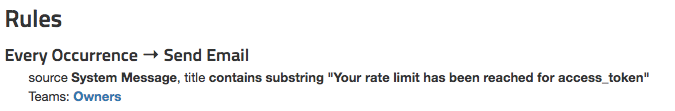

If you are using a [rollbar-php](/docs/notifier/rollbar-php/) version prior to 1.0, then rate limits will not be respected because API calls are batched.  Please see the [rollbar-php changelog](https://github.com/rollbar/rollbar-php/blob/v1.3.0/CHANGELOG.md) for details on the latest version and upgrade instructions.
{: .warning}

# Rate Limits

Rate limits allow you to control how many occurrences are saved and
processed. In turn, this gives you control over how many occurrences
count towards your monthly bill.

Each project access token can be individually configured with a
different rate limit. The default rate limit for all access tokens is 5,000 calls per minute.  If you'd like to set a higher rate limit on any of your access tokens (e.g. 10,000 calls per minute), you can do so by contacting [support@rollbar.com](mailto:support@rollbar.com).  

Once the limit is reached, all calls to POST items
will return HTTP status code `429 Too Many Requests` until the next rate
limit window begins.

If you go over your rate limit, a new error will be generated in your
project: it will show up on your dashboard, on your API errors page, and
(depending on your notification settings) you will receive an email. You
can then resolve, comment and configure notification settings for the
generated error the same way you would for others. Note: these errors
are not counted towards your bill.

You can change your rate limits as often as you want.

## Configuration

Starting from a project, Go to Settings -> Project Access Tokens and
click on the pencil icon to edit.

Next, choose a time window from the rate limit dropdown menu. Choices
are:

1.  Default rate limit
2.  1 minute
3.  5 minutes
4.  30 minutes
5.  1 hour
6.  1 day
7.  1 week
8.  30 days

Finally, enter in the maximum number of items to be saved and processed in the text box to the left of the dropdown menu and click the checkmark to save.

**Note:** New rate limits and changes to existing limits will take effect immediately.
{: .warning}

## API Response Codes

If your access token has a rate limit and has reached
it, all successful API calls will result in an HTTP 429 (Too Many
Requests) response code. Once the limit is reached, there can be a short
delay before our servers begin to reply with a 429. This does not mean
that these items will count towards your bill. These items will not be
processed and will not appear on your dashboard.

**Important!** If you're using a custom script or library to POST items you should make sure it can
handle the 429 response code.
{: .error}

## Notifications

When a rate limit is hit in a project, Rollbar automatically generates a `System Message` error with the title `Your rate limit has been reached for access_token TOKEN_NAME`.

You can configure a special _Every Occurrence_ notification rule to detect these messages and notify the appropriate team members via any notifications channel.

To identify rate limit notifications, use the following filters:

* **Source:** `System Message`
* **Title** *contains* `Your rate limit has been reached for access_token`

## Billing

At the end of your billing cycle, the total charge is calculated based
on all items saved and processed. This will not include items that were not processed due to your
rate limits.

