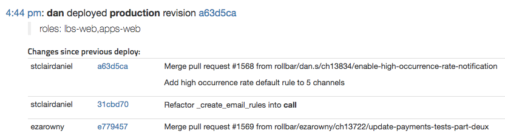

# Integrating Rollbar with Source Control

## View source from stack traces

When a Rollbar project is connected to a git repository, stack traces will include links to each file in the code version where the error was most recently activated.


To ensure that stack traces will link to the correct code version in your git repository, make sure to send the full git SHA in the `code_version` attribute of your errors.  See the instructions for your [Rollbar SDKs](/docs/notifiers) for specific instructions on using `code_version`.
{: .info}

## View commits in each deploy
When a Rollbar project is connected to a git repository, the list of commits included in each deploy will include URLs so you can view the diff for each commit as well as the entire deployed code version.



## View undeployed commits
When a Rollbar project is connected to a git repository, any commit that has been merged to your master branch but not yet deployed will be highlighted at the top of the Deploys screen.


## Resolve via commits
By adding an appropriately formatted message when committing a code change, you can tell Rollbar to automatically mark an item as resolved as soon as the commit is deployed to production.

```
$ git commit -m 'resolves rb#12345'
```
To learn more, check out [Resolving Items via commit](..//resolve-via-commits/)

## Advanced options

### Server.Root

In order to let our servers know that you want to try linking your stack trace to the files on your git repository, you should send the `server.root` key. A lot of the time that can be `/`, to indicate that all files can be linked to a file in your repository.

All [official Rollbar SDKs](../notifier/) can send this key. See the documentation for your Rollbar SDKs to learn exactly how.

An additional benefit of correctly setting `server.root` is that vendor code in your stack trace, portions that don't come from a subdirectory of `server.root`, will be collapsed. It also improves how Rollbar groups that error. We strip off `server.root` from your code where possible before using the filenames as part of the [fingerprint](../grouping-algorithm/#exception-fingerprinting). This means you can host the code from varying locations on your servers, and still correctly see otherwise identical errors as part of a single group.

Code that is considered in-project because of the `project_package_paths` key will not be linked to your repository at this time.

## Setup Instructions
To connect a Rollbar project to your git repository, just follow the steps on one of the following pages.

* [GitHub](../github/)
* [Bitbucket](../bitbucket/)
* [GitLab](../gitlab/)
