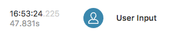
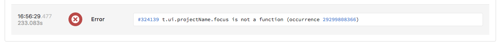

# Javascript Telemetry

In order to collect telemetry events from your client-side Javascript, make sure you are using the [latest release of rollbar.js](https://github.com/rollbar/rollbar.js/releases/latest).
{:info}

When using [rollbar.js](https://rollbar.com/docs/notifiers/rollbar.js#telemetry) in client-side Javascript, Rollbar will track and report events that happen prior to an exception or message being reported, and display them in the **Telemetry** section of an occurrence.  The telemetry timeline provides 'breadcrumbs' that can help developers understand and fix problems in their client-side Javascript, including:

* Page load events (`DOMContentLoaded`, `load`)
* User actions (`input`, `click`, navigation between routes in a single-page app)
* Network activitity (`xhr` and `fetch`) including method, URL and response code
* `Console` messages
* Other exceptions and messages sent to Rollbar

The telemetry timeline for an occurrence can be viewed with oldest or newest entries displayed first, and each entry includes both an absolute timestamp (based on the project timezone) and a relative timestamp based on when the `DOMContentLoaded` event fired.

The occurrence you are currently viewing is highlighted and shown as the final entry in the telemetry timeline.

To select which telemetry events are captured and sent along with exceptions and messages, see the config options for `autoinstrument` in the [rollbar.js docs](https://rollbar.com/docs/notifiers/rollbar.js#telemetry)
{:info}
