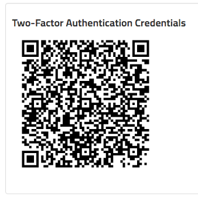
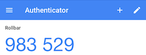

# Two-Factor Authentication (2FA)

Two-Factor Authentication (2FA) provides an extra layer of security to your Rollbar account by
requiring a one-time code in addition to a password each time you log in. Two-Factor Authentication
can be enabled by each user.

Two-Factor Authentication requires a mobile authenticator app, such as
[Google Authenticator](https://play.google.com/store/apps/details?id=com.google.android.apps.authenticator2&hl=en)
or [Authy](https://www.authy.com/).

* [Download Google Authenticator for Android](https://play.google.com/store/apps/details?id=com.google.android.apps.authenticator2&hl=en)
* [Download Google Authenticator for iOS](https://itunes.apple.com/us/app/google-authenticator/id388497605)

### Enabling Two-Factor Authentication

* Click on your username in the upper-right corner and select 'User Settings'.
* In the Two-Factor Authentication section of the settings page, enter your password and click
  'Enable two-factor authentication'.  A QR code such as the following will appear:
  
* Using your mobile authenticator app, capture the QR code. Once successfully captured, your app
  will automatically begin generating a time-sensitive code such as the following:
  
* In Rollbar, enter the code into the 'two factor code' field and click 'Validate'. If your code is
  succesfully entered, then a list of recovery codes will appear.
* Copy your recovery codes and store them in a secure location.

### Logging in with Two-Factor Authentication enabled

When Two-Factor Authentication is enabled, you will be asked to enter a code each time you log in.

* Enter the time-sensitve Two-Factor Authentication code from your mobile authenticator app and click
  'Log In' to access Rollbar.

### Disabling Two-Factor Authentication

* Click on your username in the upper-right corner and select 'User Settings'.
* In the Two-Factor Authentication Credentials section, enter your password and a Two-Factor
  Authentication code, then click 'Disable two-factor authentication'.

### Using a Recovery Code

If you do not have access to your mobile device to get a Two-Factor Authentication code, you can
disable 2FA on your Rollbar account as follows:

* Log in to your account, and click the 'Need to use your recovery code?' link
* Enter your username, password, and recovery code then log in.

Two-Factor Authentication will be disabled after you login using a recovery code, so be sure to
re-enable 2FA once you regain access to your mobile device.
