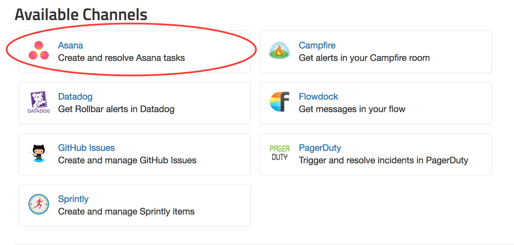
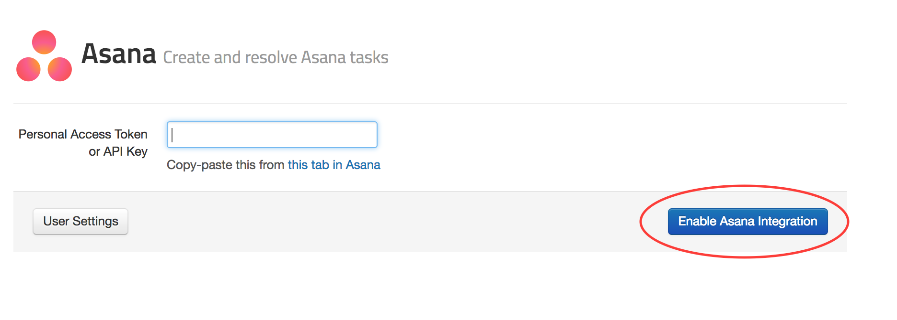
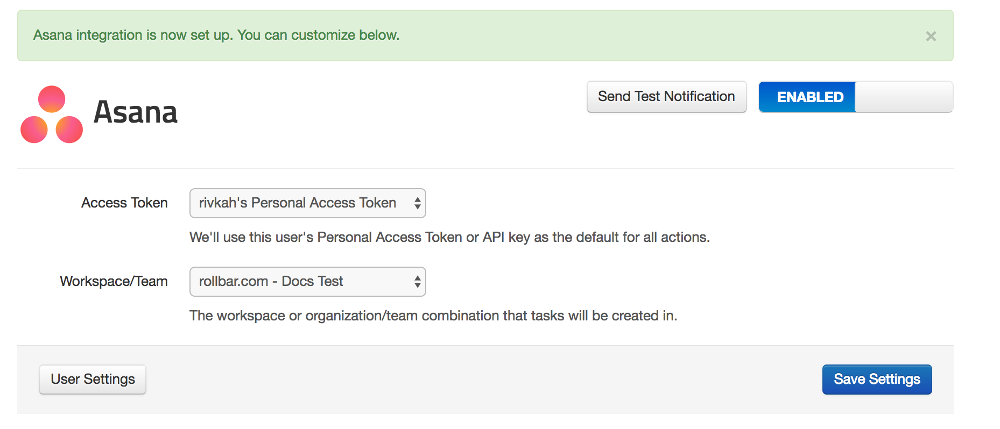
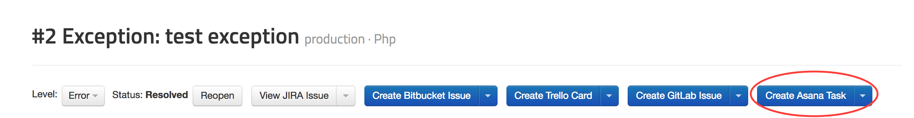
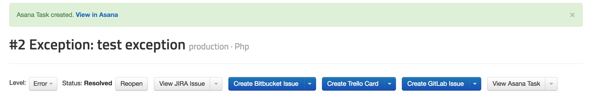
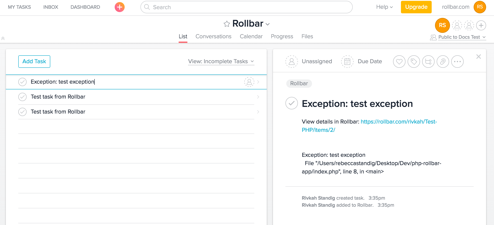
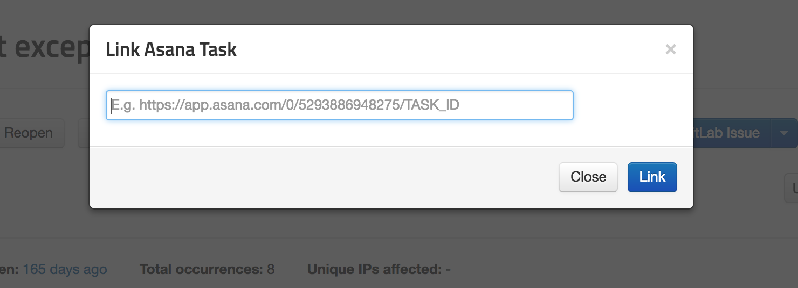

# Connecting Asana to Rollbar

Turn application errors in your [Rollbar](https://rollbar.com/) projects into Tasks in your
[Asana](https://asana.com/) Projects.

### In Rollbar

1. Visit the Settings page in Rollbar and go to Notifications. From the Notifications Settings you
   will select Asana from the list of "Available Channels".
   

2. Add your Asana personal access token or API key, and click 'Enable Asana integration'.
   

3. Once you've authorized, you'll be able to customize the type of notifications and frequency you
   want to automatically create Tasks in your Asana Projects.
   

4. Turn specific Items in Rollbar into Tasks in Asana. When viewing an Item in Rollbar simply click
   the button "Create Asana Task" to send the error details to Asana.
   
   
   

5. You can also link an Item in Rollbar to an existing Asana Task. When viewing an Item, select the
   drop down next to the Asana button and then click "Link existing Asana Task" and copy and paste
   the URL for the Asana Task you would like to link.
   

Congratulations! You have now integrated Rollbar with your Asana account. Events from Rollbar will
automatically create Tasks on your Asana Projects. If you want, you can customize the default rules
by editing, adding, or deleting them.