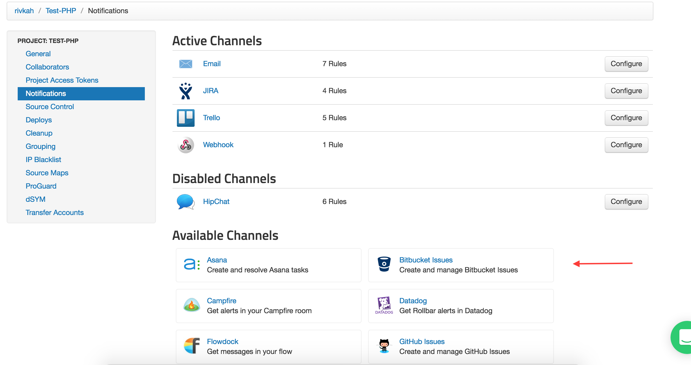
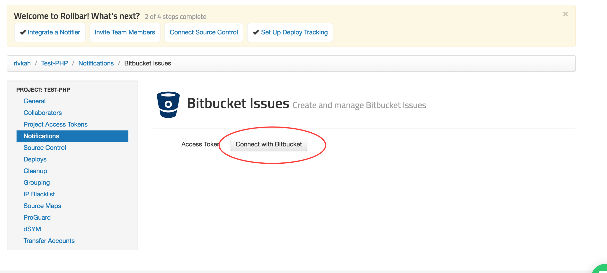
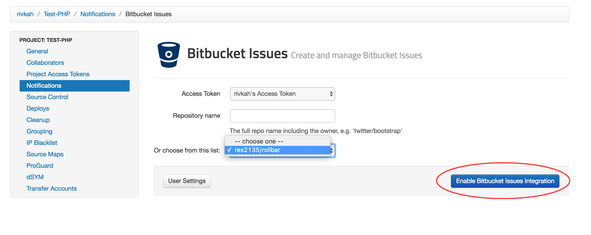
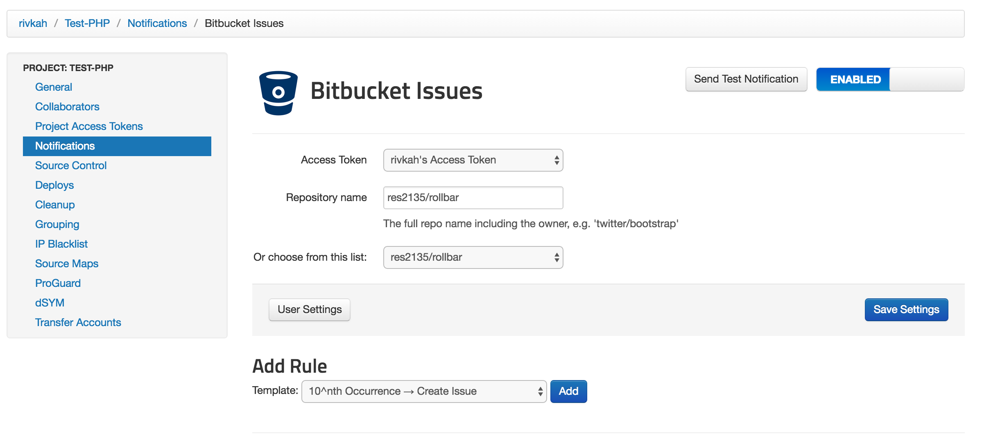
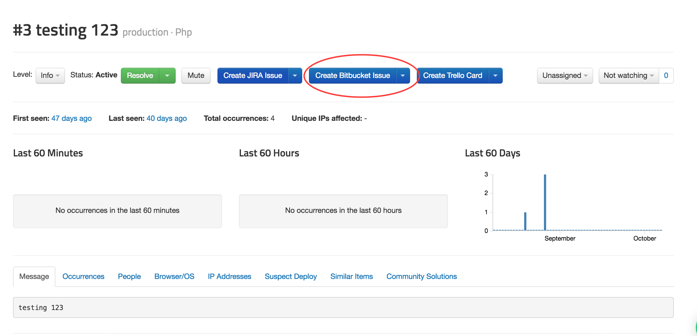
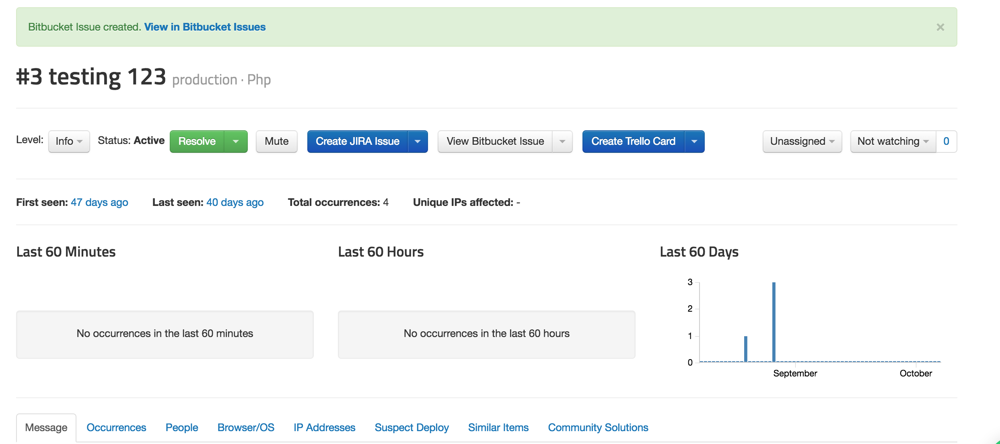
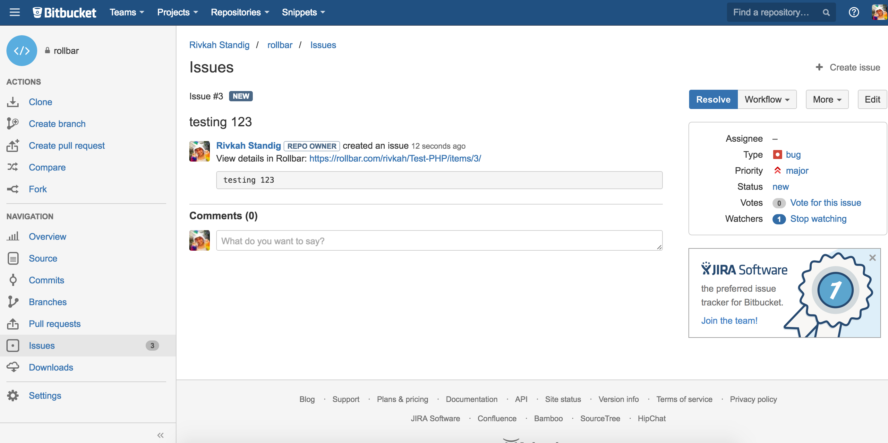
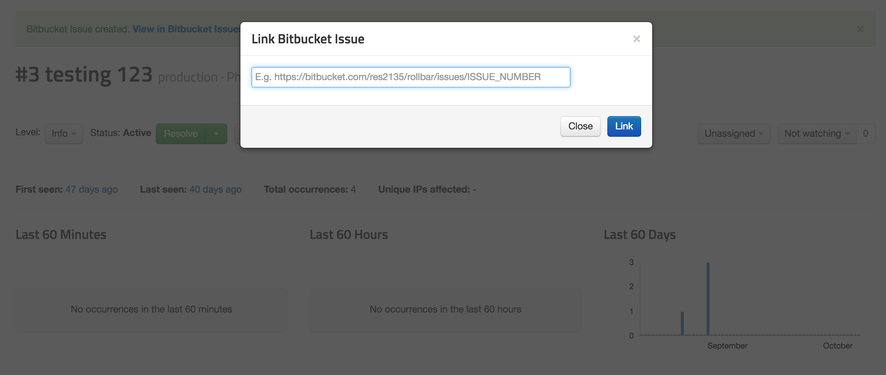

## Connecting Bitbucket to Rollbar

View the source code mentioned in Rollbar tracebacks and deploys with a single click, and turn application errors in your [Rollbar](https://rollbar.com/) projects into Issues in your [Bitbucket](https://bitbucket.org/) Repositories.

### Enabling Source Code Linking in a Rollbar Project

1. Go to the Settings section of your project then click on Source Control. 

2. If you have not yet connected to your Bitbucket account, click on Connect to Bitbucket and complete the authorization process.

3.  Select a repository from the list of available repositories, enter the branch (default is 'master') and a project root within the repository (usually this can be left blank), then save the settings.

### Viewing Bitbucket Source Code from Rollbar
Once you've successfully connected to a Bitbucket repository, Rollbar error tracebacks and deploy reports will include links to specific lines of code and revisions in your repository.

### Creating Bitbucket Issues from a Rollbar Project

1. Visit the Settings page in Rollbar and go to Notifications. From the Notifications Settings you
   will select Bitbucket Issues from the list of "Available Channels".
   

2. Click "Connect with Bitbucket".
   

3. Once you've authorized, you'll choose which repository to create your Issues in, and then click "Enable Bitbucket Issues Integration".
   

3. Now you'll be able to customize the type of notifications and frequency you want to automatically create Issues in your Bitbucket Repos.
   

4. Turn specific Items in Rollbar into Issues in Bitbucket. When viewing an Item in Rollbar simply click
   the button "Create Bitbucket Issue" to send the error details to Bitbucket.
   
   
   

5. You can also link an Item in Rollbar to an existing Bitbucket Issue. When viewing an Item, select the
   drop down next to the Bitbucket button and then click "Link existing Bitbucket Issue" and copy and paste
   the URL for the Bitbucket Issue you would like to link.
   

Congratulations! You have now integrated Rollbar with your Bitbucket account. Events from Rollbar will
automatically create Issues in your Bitbucket Repositories. If you want, you can customize the default rules
by editing, adding, or deleting them.

### Bitbucket Pipelines

Bitbucket Pipelines can be configured to report every deployment to Rollbar.  For more information and step-by-step instructions, check out [https://bitbucket.org/rollbar/rollbar-bitbucket-pipelines](https://bitbucket.org/rollbar/rollbar-bitbucket-pipelines).

### View Rollbar info in Bitbucket

By adding the [Rollbar for Bitbucket](https://marketplace.atlassian.com/plugins/com.rollbar.jira/cloud/overview)
add-on to your Bitbucket, you can view Rollbar error data in the corresponding Bitbucket issues.

To install the Rollbar for Bitbucket add-on within your Bitbucket account:

1. Go to Bitbucket Administration --> Add-ons
2. Enter "Rollbar" in the search field
3. Click on "Install" on the Rollbar for Bitbucket add-on

To install Rollbar for Bitbucket from the Atlassian Marketplace:

1. Go to <https://marketplace.atlassian.com/plugins/rollbar/cloud/overview>
2. Click 'Get it Now'

If you've already set up your Rollbar account to create issues in Bitbucket per the instructions above,
you will automatically start seeing Rollbar Linked Item data in your linked Bitbucket issues.
