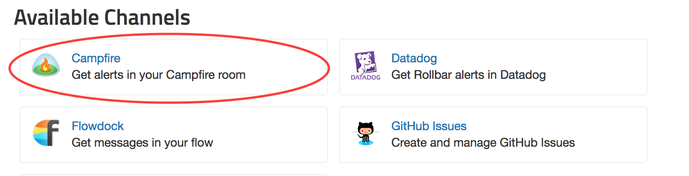
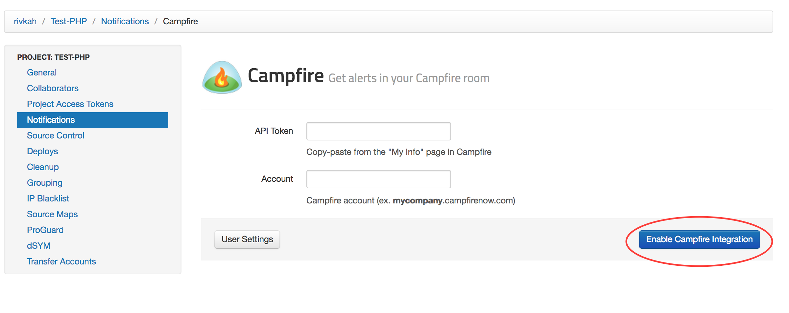

## Connecting Rollbar to Campfire

Rollbar can send messages about exceptions and deploys to a channel or
group in [Campfire](https://campfirenow.com/).

### Setup

Configuration is per-project in Rollbar.

1.  Head to the Notification settings page for a project: Dashboard ->
    Settings -> Notifications -> Campfire.
    

2.  Enter your Campfire API token and Account, and click "Enable Campfire Integration".
    
    

3.  Congrats! Campfire is now integrated with Rollbar. Default rules will
    have been created for the various events that Rollbar notifies on.
    You can customize the rules by editing them, deleting them, or
    adding new ones.
