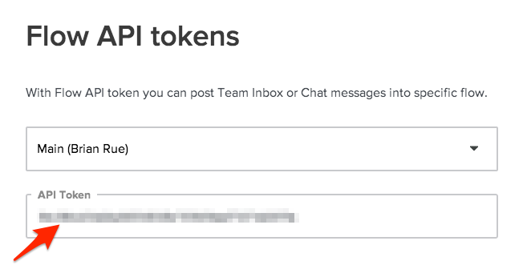
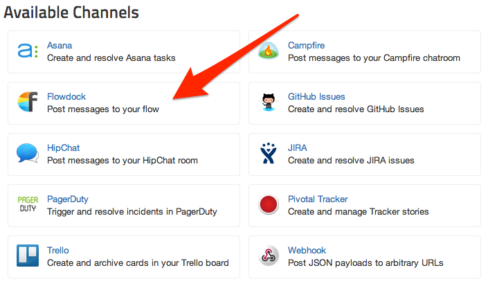
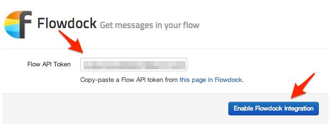
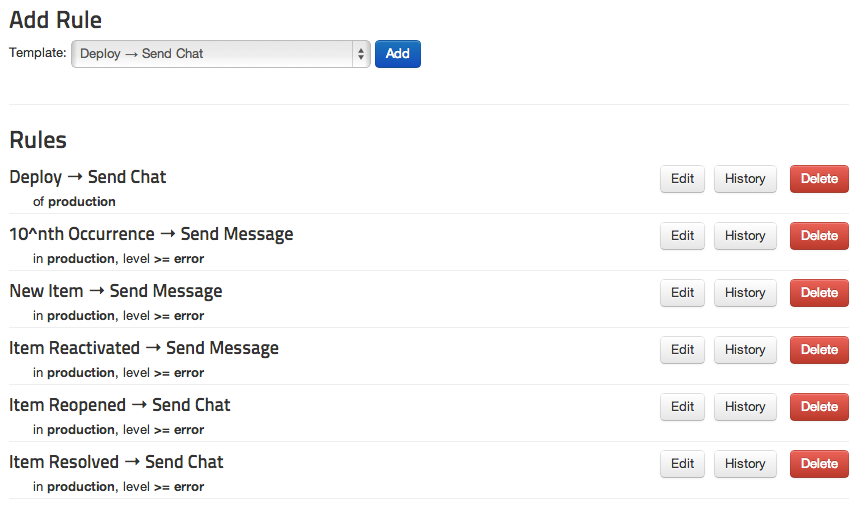

Rollbar can send messages about exceptions or deploys to your flow
in [Flowdock](http://flowdock.com/).

### In Flowdock

1.  Visit the [API Tokens](https://www.flowdock.com/account/tokens) page
    in Flowdock, and note the token for the flow where you want to
    receive Rollbar notifications.

     

### In Rollbar

1.  Navigate to the Dashboard of the project you want to integrate with
    Flowdock

    

2.  Click Settings

     

3.  Click Notifications

    

4.  Click Flowdock

     

5.  Copy-paste the API Token from Flowdock into the box in Rollbar.

     

6.  Press Enable Flowdock Integration.

7.  Congrats! You have now integrated Rollbar with your Flowdock
    account. Events from Rollbar will automatically be pushed into your
    flow. If you want, you can customize the default rules by editing,
    adding, or deleting them.

     

### Tips & Tricks
* You can customize the content of Flowdock messages using [notication variables](/docs/notification-variables/).
