## Set up Linking

Each line in your stack trace can be linked to your code in GitLab if it's hosted in a single repository. This has to be done once per project.

1. Go to the Settings section of your project then click on Source Control.
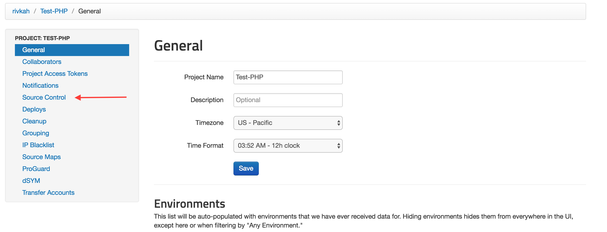

2. Click on GitLab.
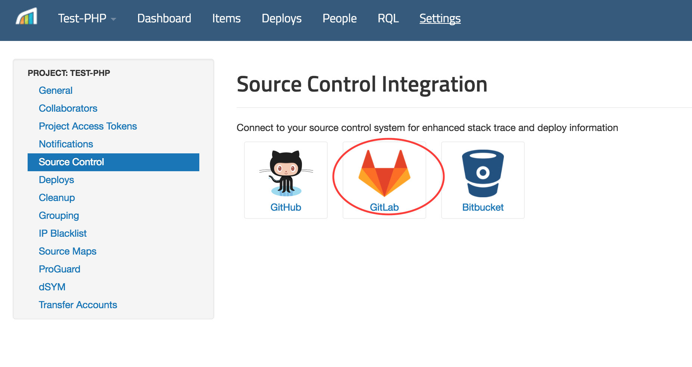

3. Click Connect to GitLab.
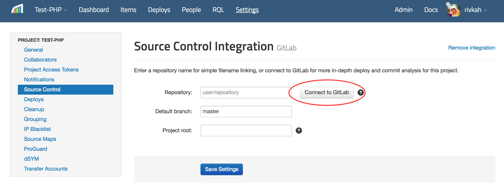

4. You will be taken to an authorization page in GitLab. Click Authorize.
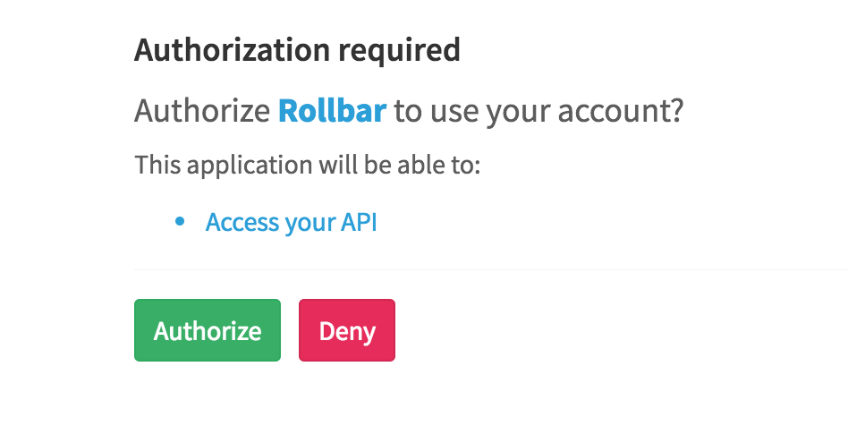
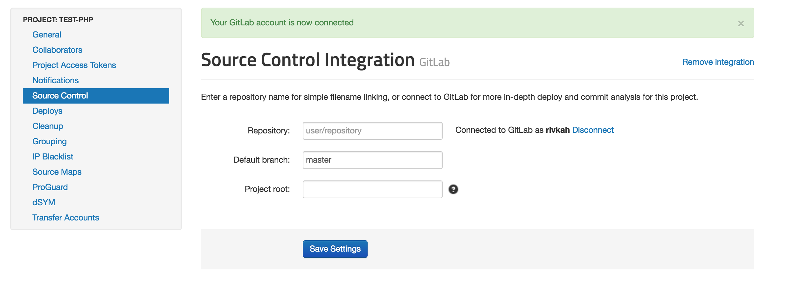

5. Select a repository from the list of available repositories, enter the branch (default is 'master') and a project root within the repository (usually this can be left blank), then save the settings.
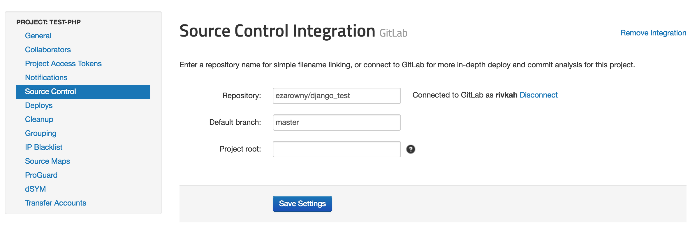

## Viewing GitLab Source Code from Rollbar
Once you've successfully connected to a GitLab repository, Rollbar error tracebacks and deploy reports will include links to specific lines of code and revisions in your repository.

## Creating GitLab Issues from a Rollbar Project

1. Visit the Settings page in Rollbar and go to Notifications. From the Notifications Settings you
   will select GitLab Issues from the list of "Available Channels".
   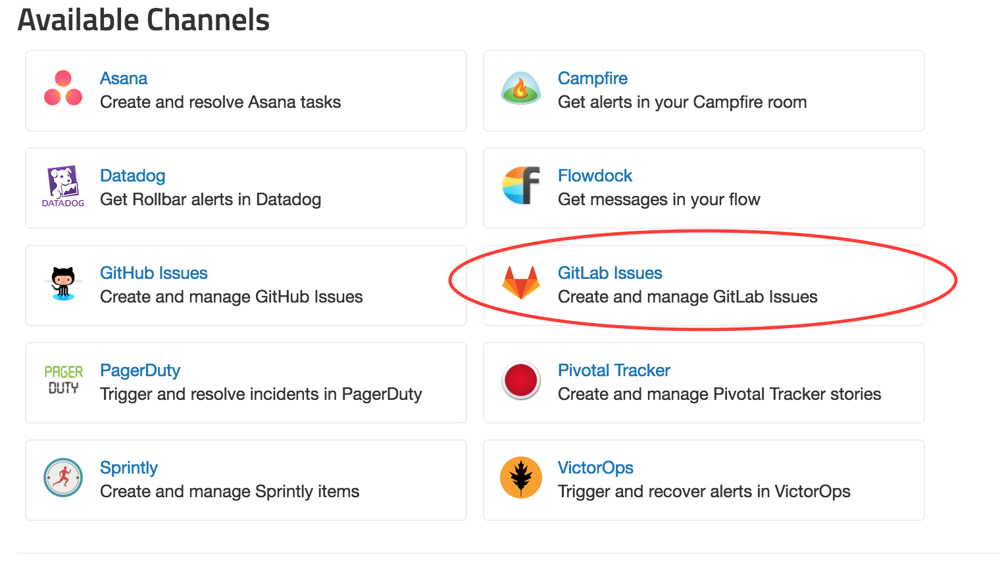

2. Click "Connect with GitLab".
   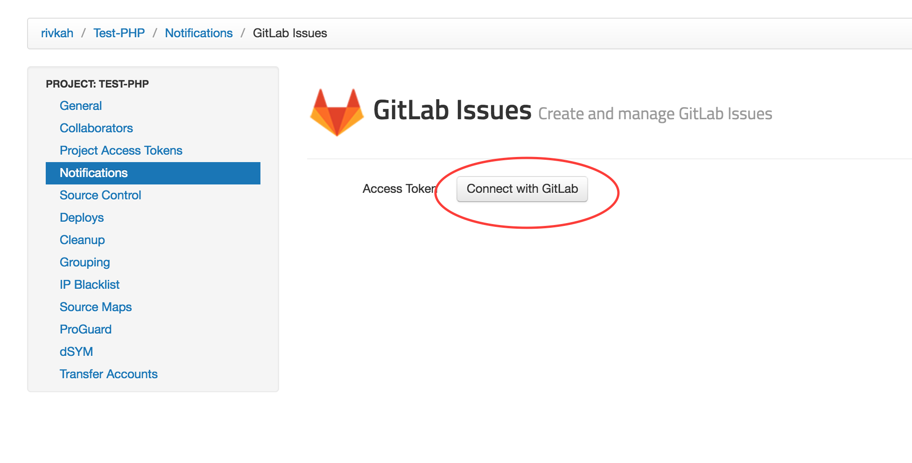

3. Once you've authorized, you'll choose which repository to create your Issues in, and then click "Enable GitLab Issues Integration".
   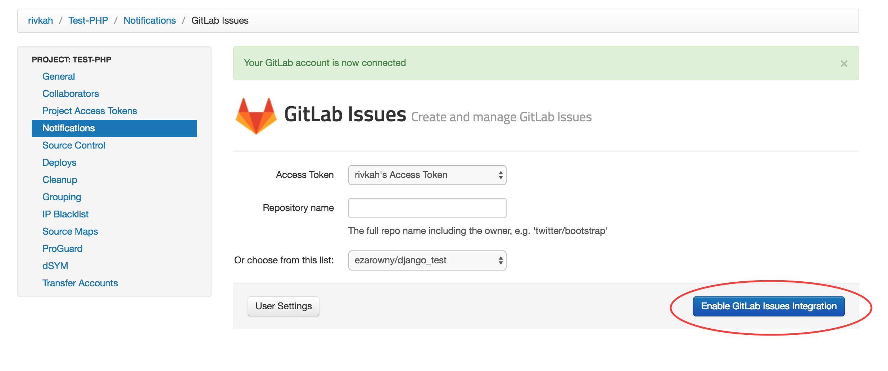

3. Now you'll be able to customize the type of notifications and frequency you want to automatically create Issues in your GitLab Repos.
   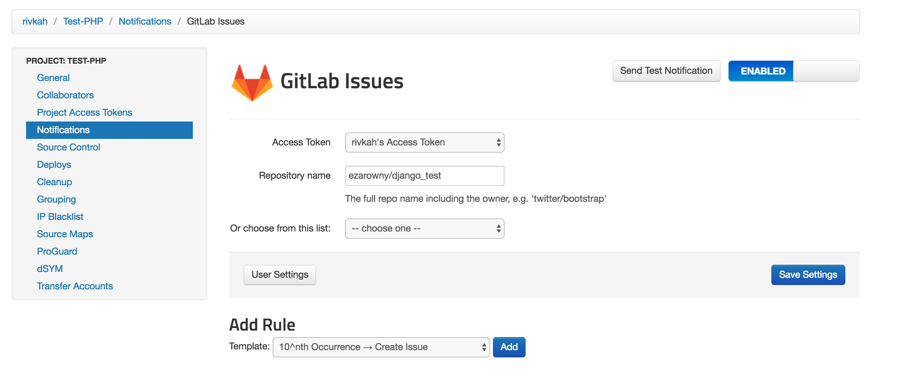

4. Turn specific Items in Rollbar into Issues in GitLab. When viewing an Item in Rollbar simply click
   the button "Create GitLab Issue" to send the error details to GitLab.
   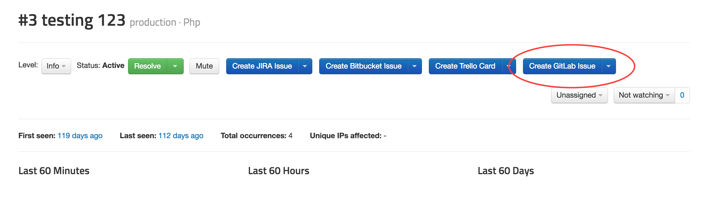
   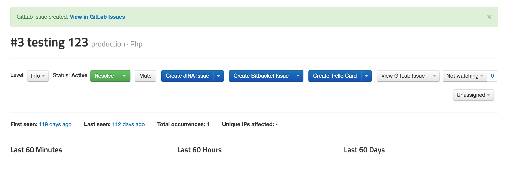
   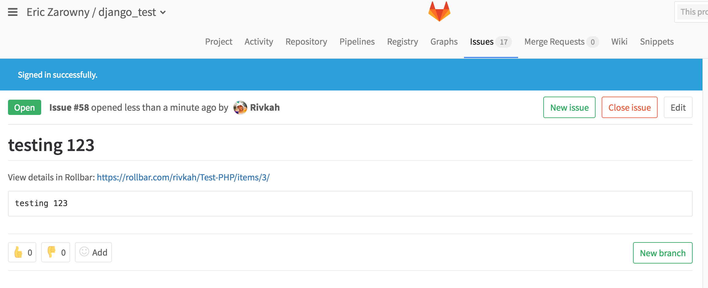

5. You can also link an Item in Rollbar to an existing GitLab Issue. When viewing an Item, select the
   drop down next to the GitLab button and then click "Link existing GitLab Issue" and copy and paste
   the URL for the GitLab Issue you would like to link.
   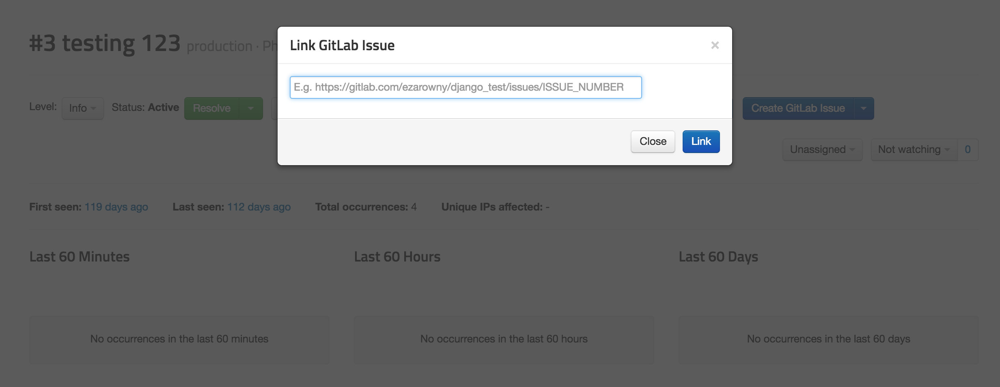

Congratulations! You have now integrated Rollbar with your GitLab account. Events from Rollbar will
automatically create Issues in your GitLab repositories. If you want, you can customize the default rules
by editing, adding, or deleting them.