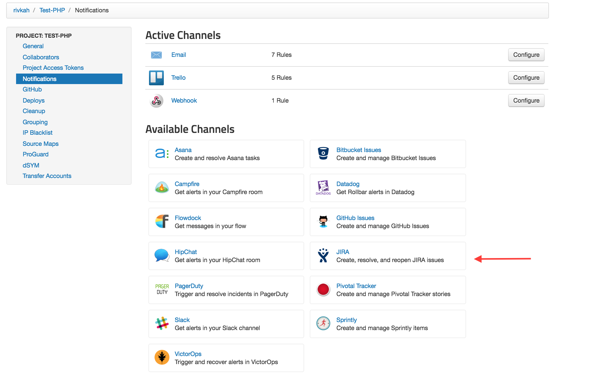
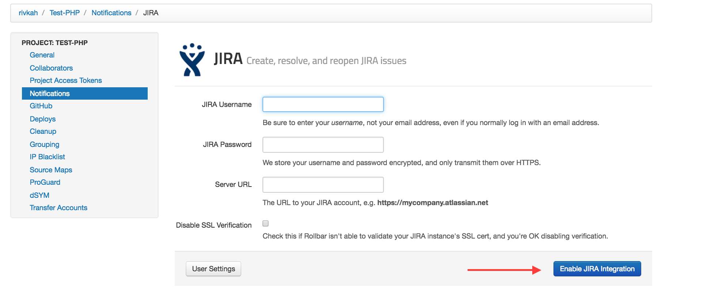
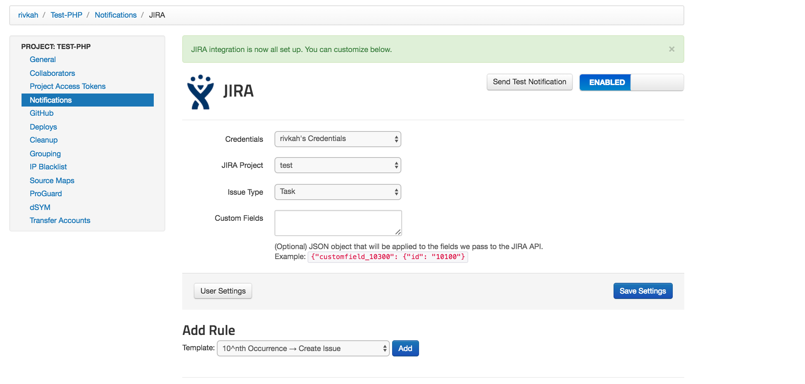
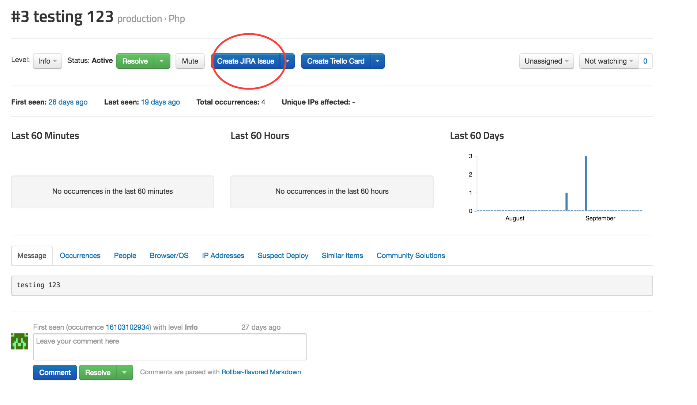
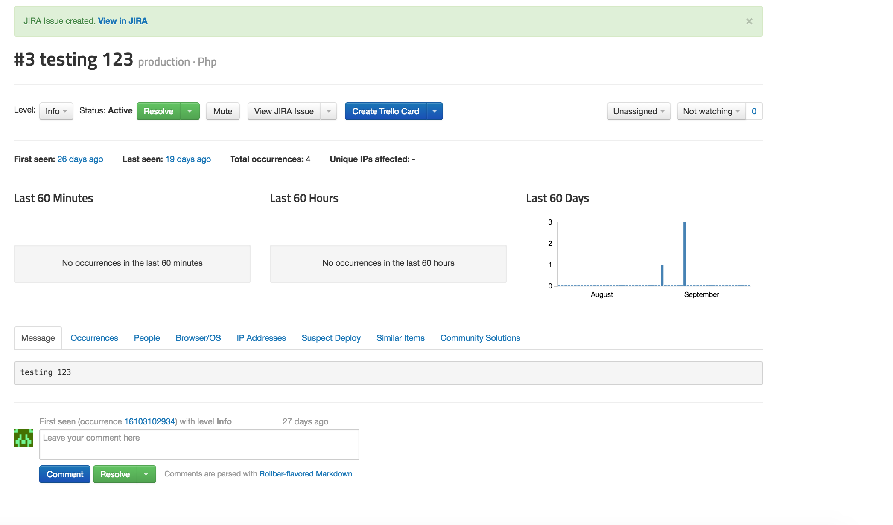
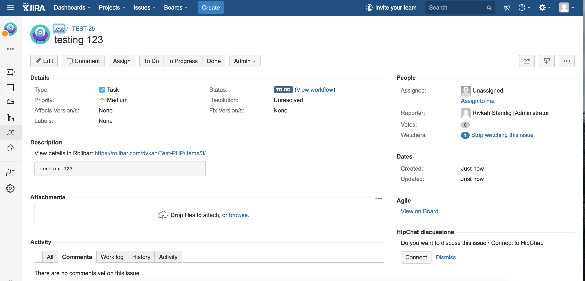
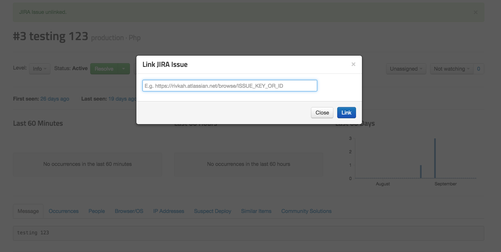

## Connecting JIRA to Rollbar
Turn application errors in your [Rollbar](https://rollbar.com/) projects into Issues in your
[JIRA](https://www.atlassian.com/software/jira) Projects.

### In Rollbar

1. Visit the Settings page in Rollbar and go to Notifications. From the Notifications Settings you
   will select JIRA from the list of "Available Channels".
   

2. Add your JIRA username, password, and server URL, and click 'Enable JIRA integration'. 
   

3. Once you've authorized, you'll be able to customize the type of notifications and frequency you
   want to automatically create Issues on your JIRA Projects.
   

4. Turn specific Items in Rollbar into Issues in JIRA. When viewing an Item in Rollbar simply click
   the button "Create JIRA Issue" to send the error details to JIRA.
   
   
   

5. You can also link an Item in Rollbar to an existing JIRA Issue. When viewing an Item, select the
   drop down next to the JIRA button and then click "Link existing JIRA Issue" and copy and paste
   the URL for the JIRA Issue you would like to link.
   

Congratulations! You have now integrated Rollbar with your JIRA account. Events from Rollbar will
automatically create Issues on your JIRA Projects. If you want, you can customize the default rules
by editing, adding, or deleting them.

### View Rollbar info in JIRA
By adding the [Rollbar for JIRA](https://marketplace.atlassian.com/plugins/com.rollbar.jira/cloud/overview) add-on to your JIRA, you can view Rollbar error data in the corresponding JIRA issues.

