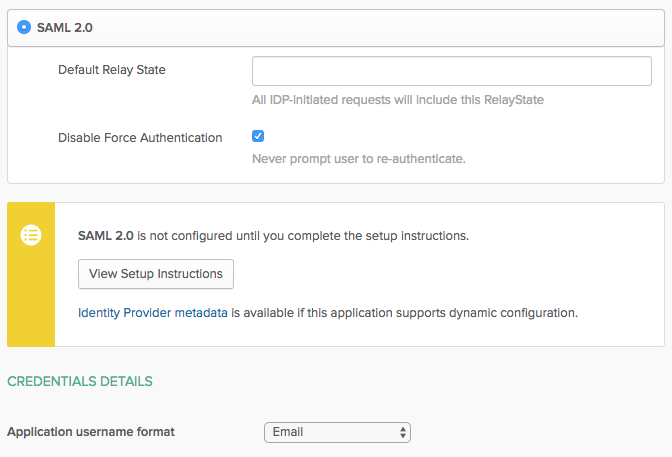
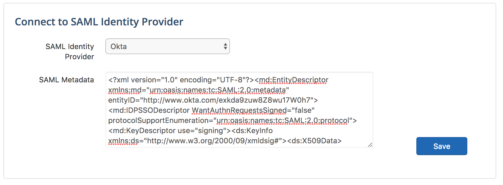
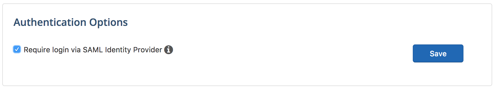
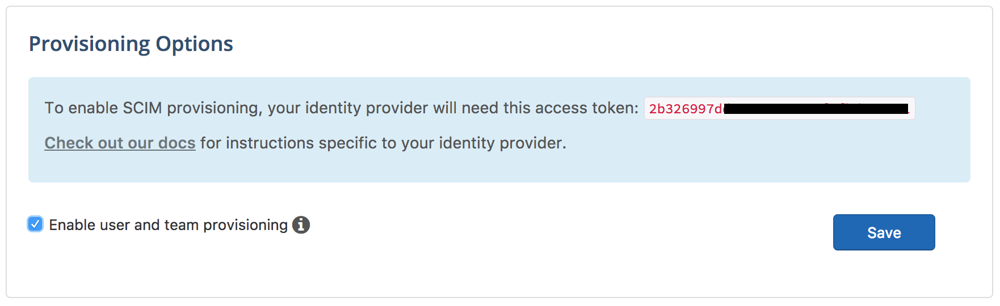
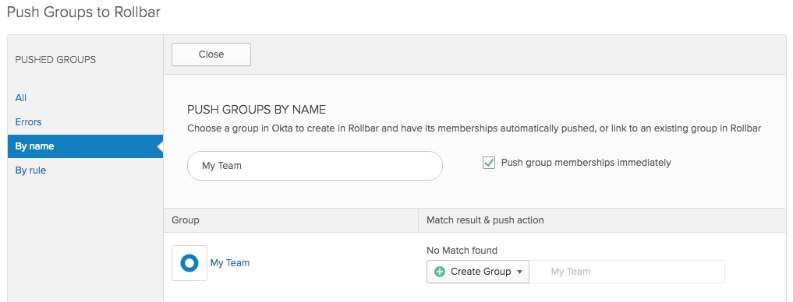
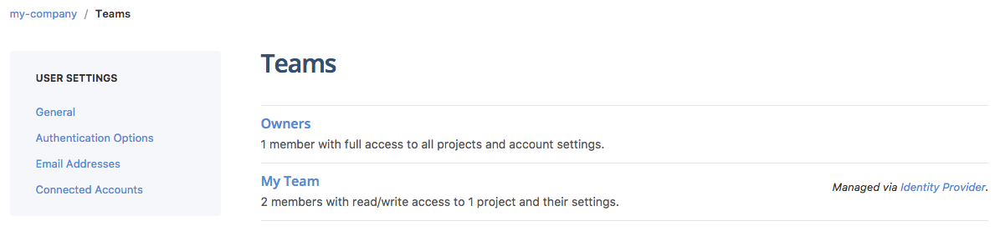
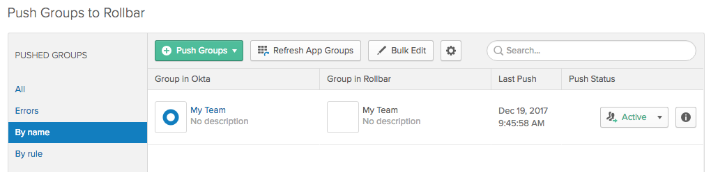

# Okta

In order to complete the instructions in this document, you must be an administrator in your Okta account and an owner in your Rollbar account.
{: .warning}

Okta can be used for both SAML-based authentication and SCIM-based team and user provisioning in Rollbar.

## Step 1: Add Rollbar as an application in Okta

**In Okta:**

* Go to **Admin > Applications**.
* Click on **Add Application**.

* Search for `Rollbar` and click **Add**.

* In the **General Settings** screen, enter `Rollbar` as the application label, your Rollbar account name (found at `https://rollbar.com/{accountname}`), and then click **Next**.

* In the **Sign-On Options screen**, select `SAML 2.0` as the Sign-On Method, set **Application username format** to `Email`, click **Identity Provider Metadata** to download your SAML metadata, then click `Done`.

**In Rollbar:**

* Go to **{account name} Settings > Identity Providers**

* Select `Okta` as your identity provider, paste your XML metadata, and click **Save**

* Optionally, you may require all Rollbar users to authenticate via Okta to access your account.

**In Okta:**

* Assign groups and users to the Rollbar application.

After following these steps, Okta users with an existing Rollbar user may log in via Okta.  To enable provisioning of Rollbar users and teams from Okta, follow the instructions in the next section.
{: .info}

## Step 2: Enable provisioning of Rollbar teams and users

Provisioning is currently available on **enterprise plans only**.  To learn more or request to have it enabled, please contact [sales@rollbar.com](mailto:sales@rollbar.com).
{: .warning}

**In Rollbar:**

* Go to **{account name} Settings > Identity Providers**.

* In the **Provisioning Options** section, copy the access token, select **Enable user and team provisioning** and click **Save**.

**In Okta:**

* Go to **Admin >Applications** and select **Rollbar**.
* Click on the **Provisioning** tab then click **Configure API Integration**.

* Select **Enable API Integration**, paste your access token into the **API Token** field, click **Test API Credentials**, and then click **Save**.

* In the Provisioning settings, click on **To App**, then click **Edit**, enable all the options, and click **Save**.

* Go to the **Push Groups** tab, Click on the **Push Groups** button, and select ** Add select **Find Groups by Name**.  Add each of the groups that you'd like to add as teams to your Rollbar account, choosing to push group membership immediately and create the team.

Once your Push group has been added, it will automatically appear as a team in Rollbar, where it can be assigned to projects.  Membership in the team is controlled entirely via your Okta groups.

Push groups are managed via the **Push Groups** tab in Okta.  To remove a group from Rollbar, select **Unlink push group**, and then **Delete the group in the target app**.
