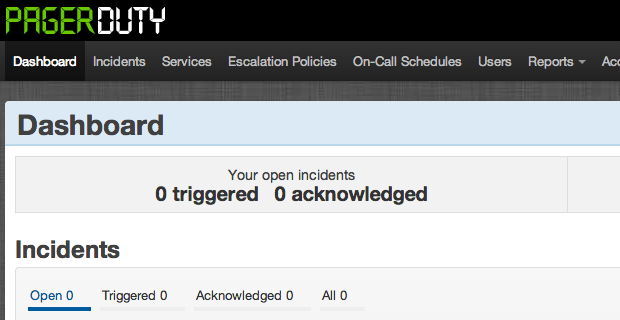
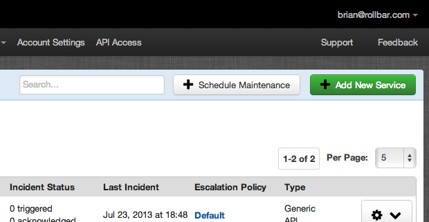
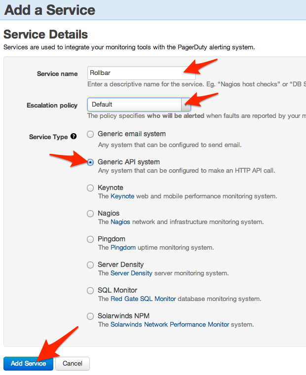
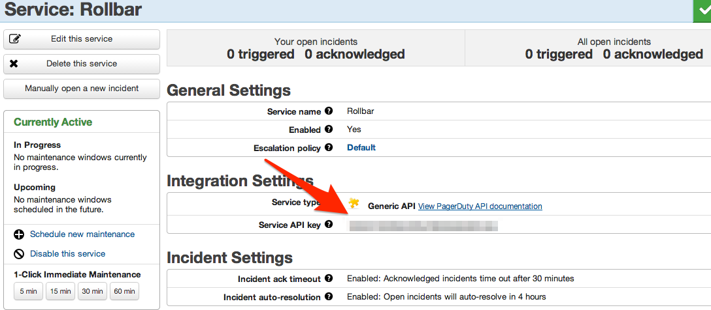
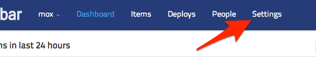
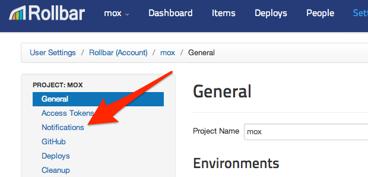
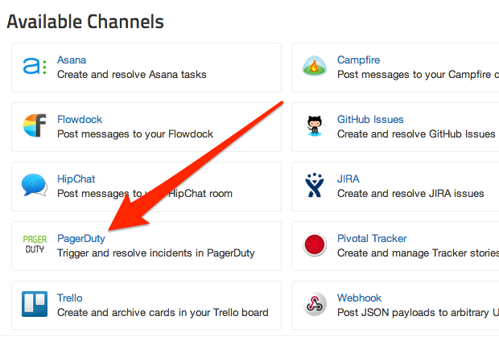
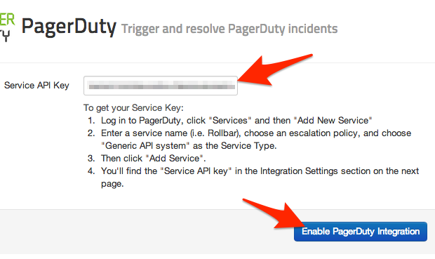
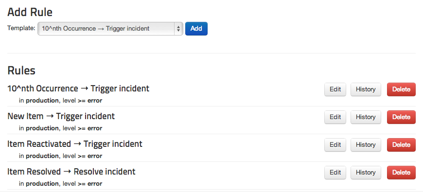

# Connecting Rollbar to PagerDuty

Rollbar can create, update, and resolve Incidents
in [PagerDuty](http://pagerduty.com/).

### In PagerDuty:

1.  From the PagerDuty dashboard, click Services from the navigation bar
    at the top of the page.

    

2.  On the right side of the page, click the green Add New
    Service button.

    

3.  Fill in the service name (e.g. "Rollbar").

    

4.  Select an escalation policy.

5.  Under Service Type, choose Generic API system.

6.  Click the \*Add Service button at the bottom.

7.  On the service page under Integration Settings, note the string next
    to Service API key.

    

### In Rollbar

1.  Navigate to the Dashboard of the project you want to integrate with
    PagerDuty

    

2.  Click Settings

    

3.  Click Notifications

    

4.  Click PagerDuty

    

5.  Copy-paste the Service API key from PagerDuty into the box in
    Rollbar.

    

6.  Press Enable PagerDuty Integration.

7.  Congrats! You have now integrated Rollbar with your PagerDuty
    account. Now, when a new error or higher occurs in your production
    environment in Rollbar, it will create an incident in PagerDuty, and
    incidents in PagerDuty will be automatically resolved when they are
    resolved in Rollbar. If you want, you can customize the default
    rules by editing, adding, or deleting them.

    
