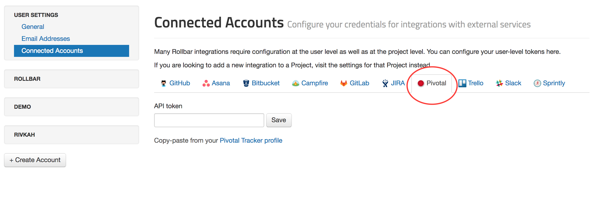
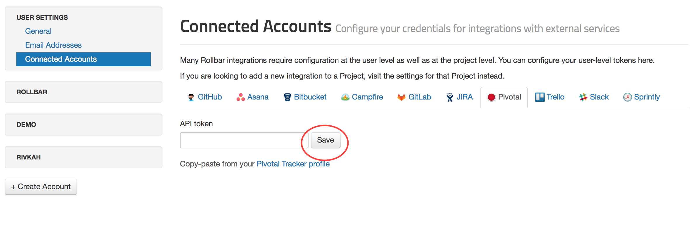
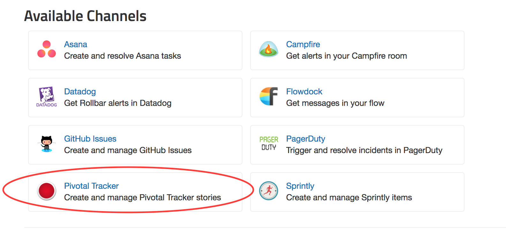
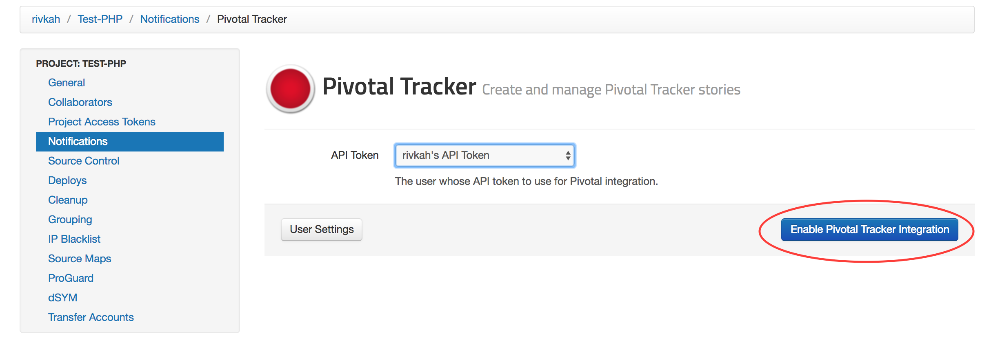
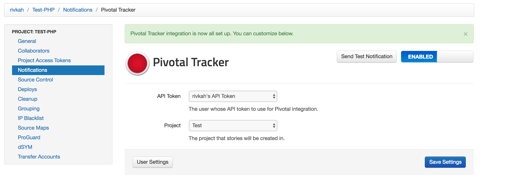
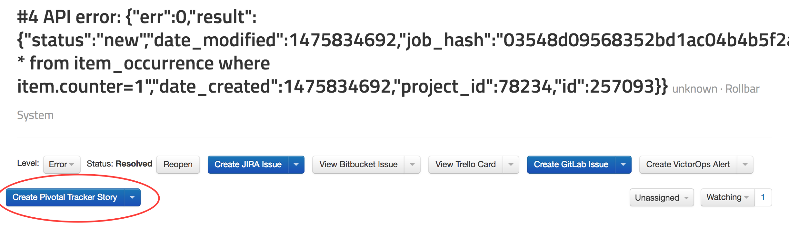
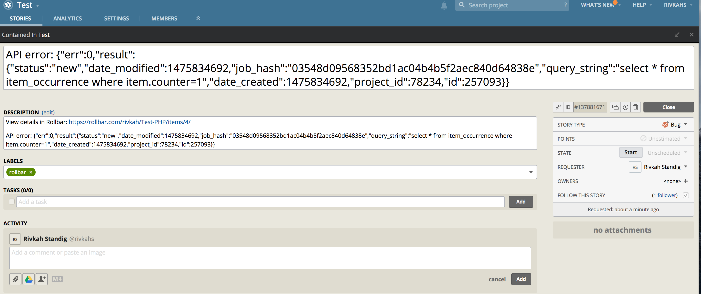

## Connecting Rollbar to Pivotal

You can turn Rollbar events into Stories in [Pivotal Tracker](https://www.pivotaltracker.com/).

### Connect your Account

Get started by going to your [account settings](https://www.rollbar.com/settings/integrations).
Navigate to the Pivotal tab.

In Pivotal, navigate to your [profile](https://www.pivotaltracker.com/profile) and copy your API token. Paste your API token in Rollbar and click "Save."

### Setup

Configuration is per-project in Rollbar.

1.  Head to the Notification settings page for a project: Dashboard -> Settings -> Notifications -> Pivotal Tracker.
    

2. 	Choose the API token you want to connect to Pivotal with, and click "Enable Pivotal Tracker Integration."
	

4.  Congrats! You have now integrated Rollbar with your Pivotal Tracker
    account. If you want, you can customize the default rules by editing, adding, or deleting them.
    

5.	Turn specific Items in Rollbar into Stories in Pivotal. When viewing an Item in Rollbar simply click
	the button "Create Pivotal Tracker Story" to send the error details to Pivotal.
    
    

