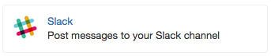
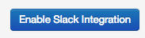
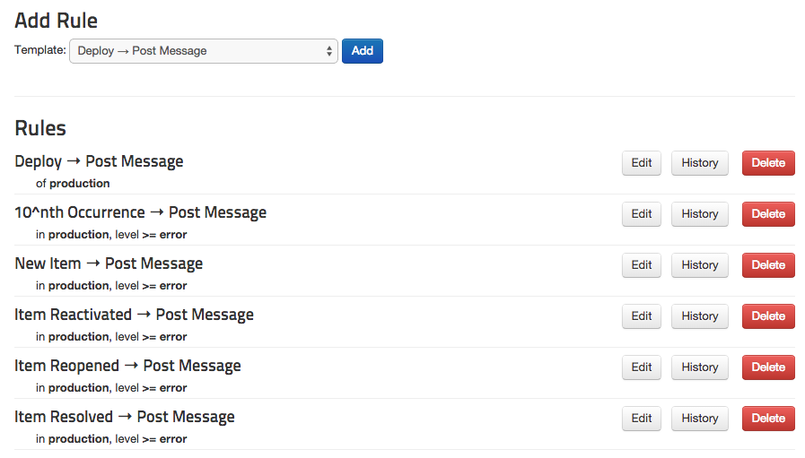

## Connecting Rollbar to Slack

Rollbar can send messages about exceptions and deploys to a channel or
group in [Slack](https://slack.com/).

### Setup

Configuration is per-project in Rollbar.

1.  Head to the Notification settings page for a project: Dashboard ->
    Settings -> Notifications -> Slack.

    

2.  Click **Connect with Slack**

3.  Select the Slack team you want to integrate with, and authorize the
    permission request.

4.  Select the channel or group you wish to receive messages for

5.  Click **Enable Slack Integration**

    

6.  Congrats! Slack is now integrated with Rollbar. Default rules will
    have been created for the various events that Rollbar notifies on.
    You can customize the rules by editing them, deleting them, or
    adding new ones.

    

### Tips & Tricks

* You can customize the content of Slack messages using [notication variables](/docs/notification-variables/).
* In addition to notification variables, any data value sent in the JSON payload of an item or occurrence may be used as a variable, including custom data. Examples of usage are {{"{{request.url"}}}} and {{"{{server.host"}}}}. If your JSON payload includes the custom values {{"{{ handler: { key: process-job, id:100"}}}} then you can use the variables {{"{{handler.key"}}}} and {{"{{handler.id"}}}} in your notifications. To view the full set of available values, look at the "Params" values of an occurrence in your project.
* You can mention specific Slack users in notification messages using the syntax `@username`
* To mention `@channel`, `@group`, `@here`, or `@everyone`, use the syntax `<!channel>`, `<!group>`, `<!here>`, or `<!everyone>`.
