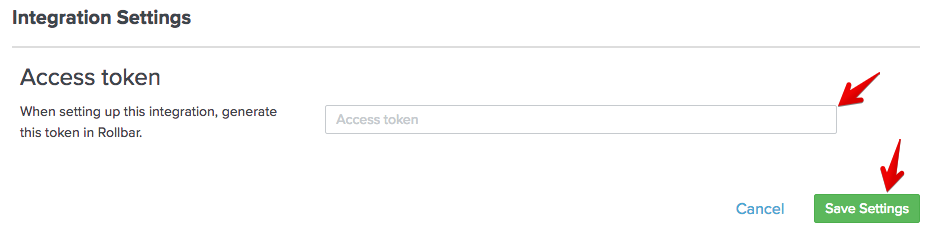

Are you new to Rollbar?
[If so, click here to learn more about Rollbar and sign up!](https://rollbar.com/)
{: .info}

If you use [Split](http://www.split.io) to create and manage customized rollout plans, you can now bring Split event data into Rollbar to fix user issues quicker than before. 

### Setup
1. Visit the Settings page in Rollbar and go to Project Access Tokens.

2. Click Add new access token.

3. Edit the new token and rename to split. Ensure `post_server_item` is the only item checked.

### In Split
4. Go to Admin Settings and click Integrations. Click Add next to Rollbar.

5. Copy your Rollbar split access token that you created in step 3 and paste the token.

6. Click Save Settings. 

Split notifications will now flow into Rollbar.
