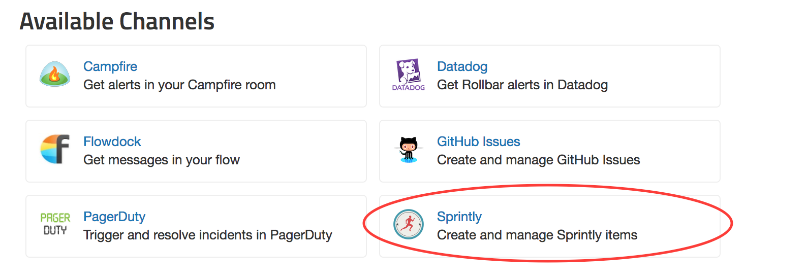
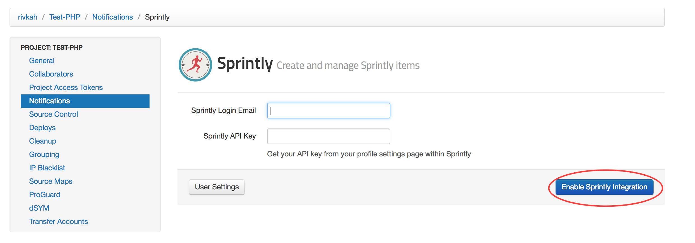
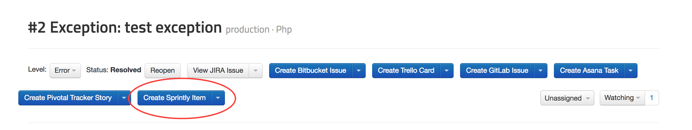
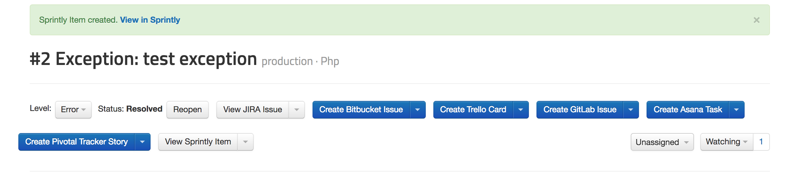
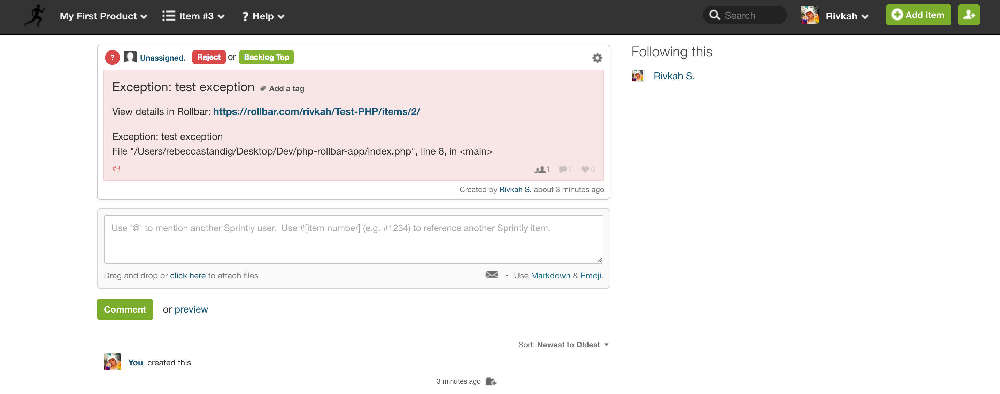
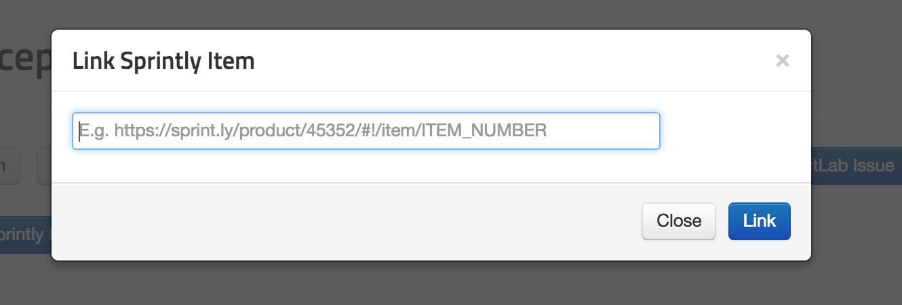

# Connecting Rollbar to Sprintly

You can turn Rollbar events into Items in [Sprintly](https://sprint.ly).

### Setup

Configuration is per-project in Rollbar.

1.  Head to the Notification settings page for a project: Dashboard -> Settings -> Notifications -> Sprintly.
    

2. 	In Sprintly, go to your [profile settings page](https://sprint.ly/account/settings/profile) and copy your API key, then paste it into Rollbar.

3.	Enter your Sprintly login email, and click "Enable Sprintly Integration".
    

4.  Once you've authorized, you'll be able to customize the type of notifications and frequency you want to automatically create Items in 			Sprintly.
	

5. Turn specific Items in Rollbar into Items in Sprintly. When viewing an Item in Rollbar simply click
   the button "Create Sprintly Item" to send the error details to Sprintly.
	
	
	

6. You can also link an Item in Rollbar to an existing Sprintly Item. When viewing an Item, select the
   drop down next to the Sprintly button and then click "Link existing Sprintly Item" and copy and paste
   the URL for the Sprintly Item you would like to link.
   	

Congratulations! You have now integrated Rollbar with your Sprintly account. Now, when a new error or higher occurs in Rollbar, it will create an Item in Sprintly, and Items in Sprintly will be automatically resolved when they are resolved in Rollbar. If you want, you can customize the default rules by editing, adding, or deleting them.
