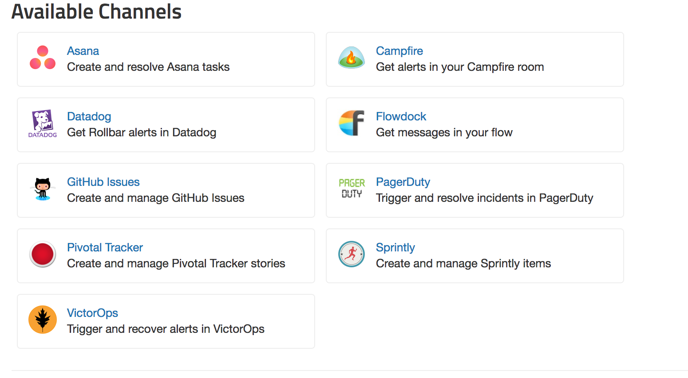
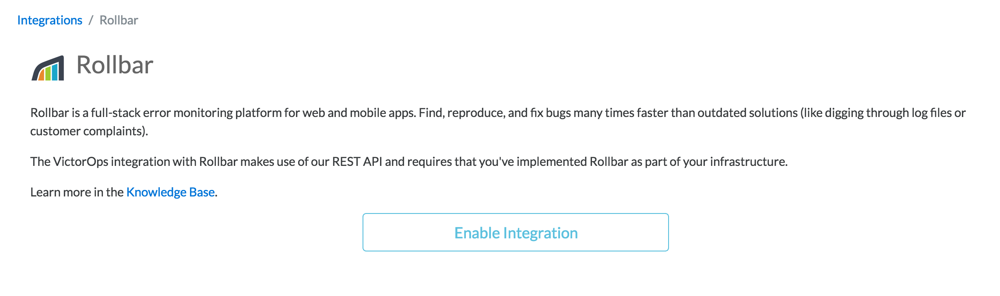
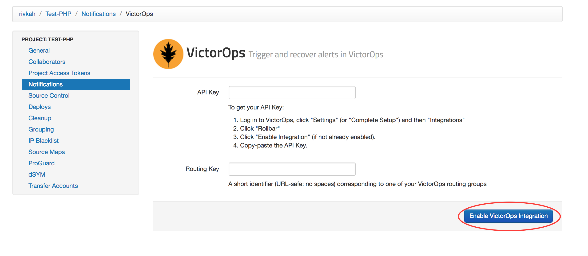

# Connecting Rollbar to VictorOps

You can turn Rollbar events into Alerts in [VictorOps](https://victorops.com/).

### Setup

Configuration is per-project in Rollbar.

1.  Head to the Notification settings page for a project: Dashboard -> Settings -> Notifications -> VictorOps.
    

2. 	In VictorOps, go to Settings (or Complete Setup) -> Alert Behavior -> Integrations, and choose Rollbar.
	

3.	Click "Enable Integration" if it's not already enabled.
	

4.  Copy the API key from VictorOps. In Rollbar, enter the API and routing keys, and click "Enable VictorOps Integration."
	

5.  Congrats! You have now integrated Rollbar with your VictorOps
    account. Now, when a new error or higher occurs in Rollbar, it will create an Alert in VictorOps, and
    Alerts in VictorOps will be automatically resolved when they are resolved in Rollbar. If you want, you can customize the default
    rules by editing, adding, or deleting them.
